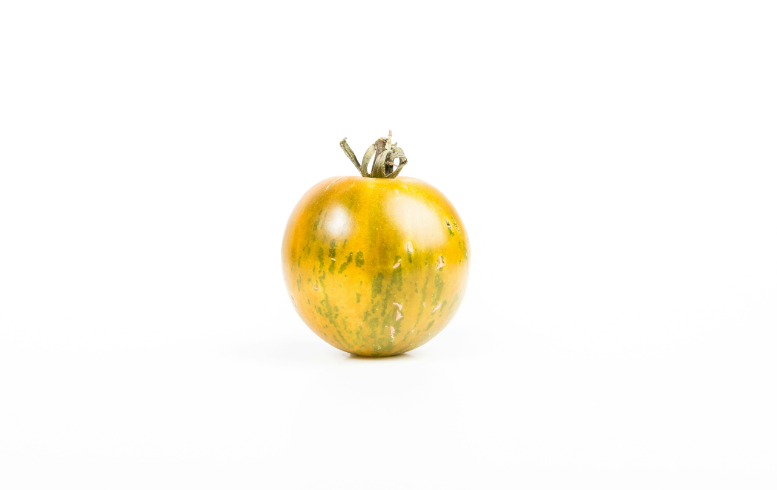
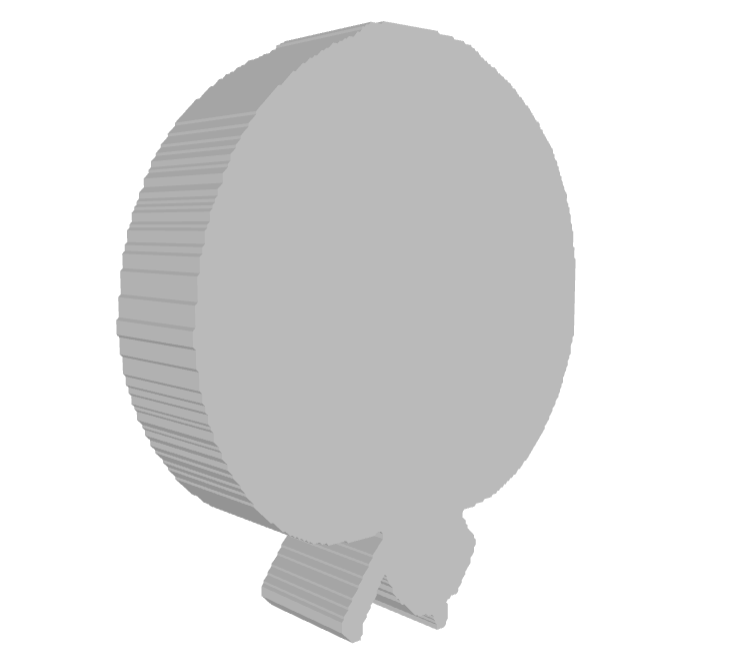
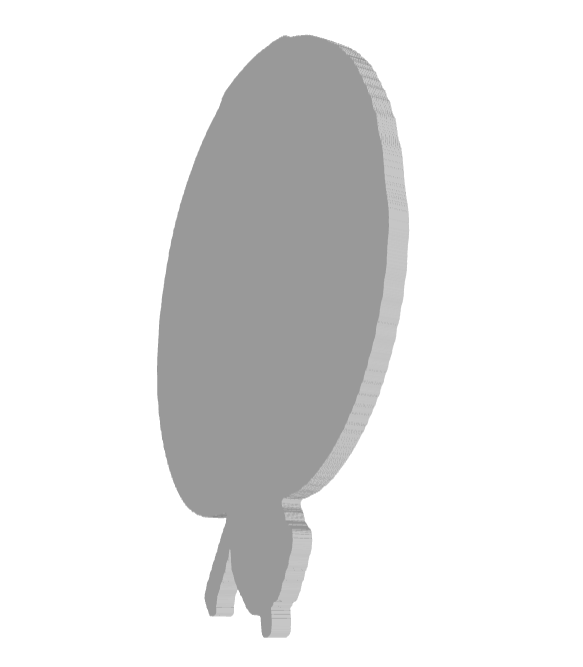

# Image to 3D Object Prototype

## Description
This prototype converts a photo of a single object (like a toy, car, or chair) into a basic 3D `.obj` model using background removal and contour-based extrusion.

## Features
- Accepts `.jpg` or `.png` image
- Removes background using `rembg`
- Detects object contours and extrudes them into a 3D shape
- Outputs `.obj` file

## Setup

```bash
python -m venv venv
pip install -r requirements.txt
```
## Run

```bash
python main.py
```
Enter the image when prompted.

## Output
` output.obj`: 3D file

## Libraries Used
`rembg`: background removal

`OpenCV`: image processing

`trimesh`: 3D extrusion and export

`matplotlib`: visualization

`shapely`: 2D polygon handling

## Thought Process
I chose a contour-based extrusion method for simplicity and speed. After removing the background, I extracted the object's contour, turned it into a polygon, and extruded it vertically. We can control the height of the extrusion in the code.

## Example
Original image:


3D image for excrusion height of 50:


3D image for excrusion height of 20:

